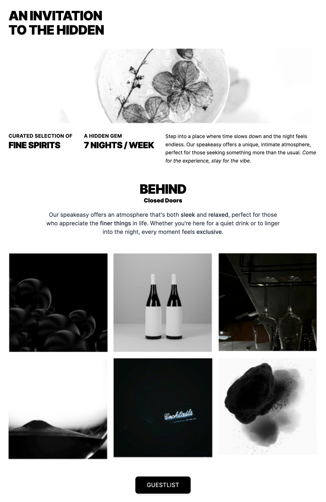

# 🏝️ ISLAND – Web Developer Coding Challenge

This project was developed as part of the **Web Developer Hiring Challenge**.  
The task was to **recreate the provided design as closely as possible** using only:

- **HTML5**
- **Tailwind CSS** (with custom classes if necessary)
- **Vanilla JavaScript** (no frameworks, no CMS)

The result is a **pixel-perfect**, **responsive**, and **interactive** web page with subtle enhancements.

---

## 🚀 Live Demo
- 🌐 **Live Preview**: [refined-island.vercel.app](https://refined-island.vercel.app/)
- 💻 **GitHub Repository**: [ISLAND Challenge Repo](https://github.com/PeaceAntoHim/island.git)

---

## 📸 Preview
Here’s a quick glimpse of the project:



---

## ✨ Features

### 1. Pixel-Perfect Design
- Matches the given layout, spacing, colors, and typography.
- Clean semantic HTML structure.

### 2. Responsive Design (Mobile-First)
- Works seamlessly on **mobile**, **tablet**, and **desktop**.
- Uses Tailwind responsive utilities (`sm:`, `md:`, `lg:` breakpoints).

### 3. JavaScript Features
- 🖼️ **Image Modal** → Click on a gallery image to view it in a fullscreen modal (with fade & zoom animation).
- ✅ **Guestlist Modal** → Join form with validation and a toast notification when submitted.

### 4. Extra Enhancements (Bonus)
- Smooth hover animations (zoom, shadow, opacity).
- Animated modal transitions (fade-in, zoom-in/out).
- Custom favicon (`favicon.svg`) for brand identity.
- Accessible markup with focus styles and aria-friendly modal.

---

## 📱 Responsiveness
- **Headings** scale: `text-2xl sm:text-3xl md:text-4xl lg:text-5xl`.
- **Gallery**: `grid-cols-1 sm:grid-cols-2 md:grid-cols-3`.
- **Spacing** adjusts with `p-4 sm:p-6 md:p-8`.
- **Modal & forms** adapt with `w-11/12 sm:w-full` for mobile usability.

---

## 🛠️ Tech Stack
- **HTML5** – semantic structure
- **Tailwind CSS (via CDN)** – utility-first responsive design
- **Vanilla JavaScript** – interactivity (modals, toast)
- **Vercel** – deployment and hosting
- **GitHub** – version control & collaboration

---

## 📂 Project Structure
```bash
├── assets/          # Images, favicon
├── index.html       # Main HTML page
├── style.css        # Custom CSS (if needed)
├── script.js        # Modal & toast logic
└── README.md        # Documentation
```


## ⚙️ Setup & Development
1. Clone the repository: `git clone https://github.com/PeaceAntoHim/island.git`
2. cd island
3. run index.html